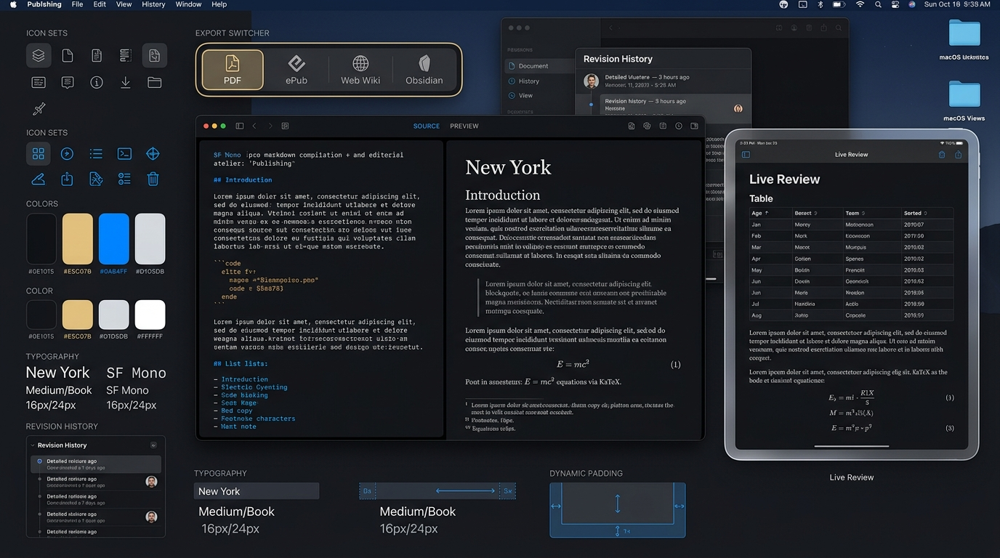

> **IMPLEMENTATION DIRECTIVE (2026-08-27, per Thomas):** This mood board is the chosen design direction for this app. Implementing it is **mandatory, not optional**. Follow its palette, typography, materials, and interaction model; adapt to platform constraints, but do not substitute the direction. Work is not done until the app's surfaces visibly reflect this document in a running build. Justify any divergence in the commit message.

# Publishing Studio — Visual Design System & Winning Mood Board

**Winning Aesthetic:** Cupertino Editorial Atelier & Spatial Typography Studio

## Core Design Principles
- **Aesthetic:** macOS Sequoia & visionOS spatial glassmorphism, 1px specular highlight rims (`backdrop-filter: blur(28px)`).
- **Typography:** Apple SF Pro / SF Pro Rounded paired with SF Mono and New York Editorial Serif where appropriate.
- **Surface Elevation:** Deep obsidian canvas base with multi-tier frosted translucent glass slabs.
- **Telemetry & Controls:** High signal-to-noise ratio, tactile segmented control capsules, and luminous live status telemetry.
